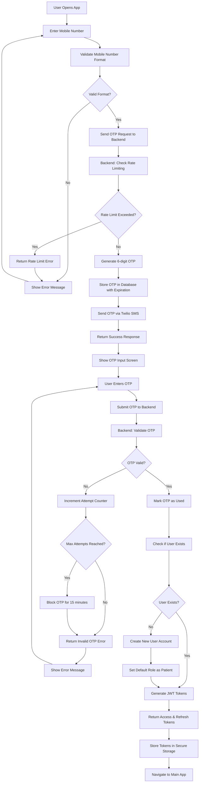
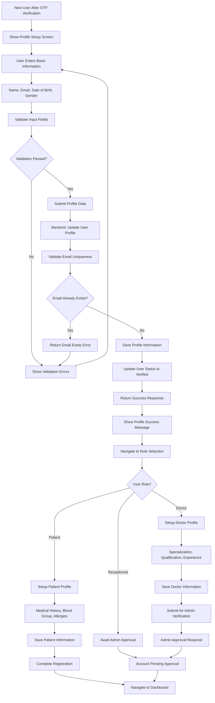
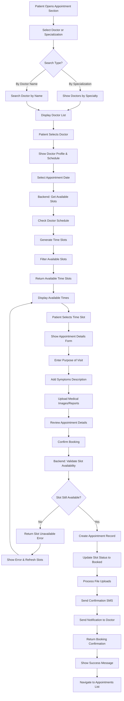
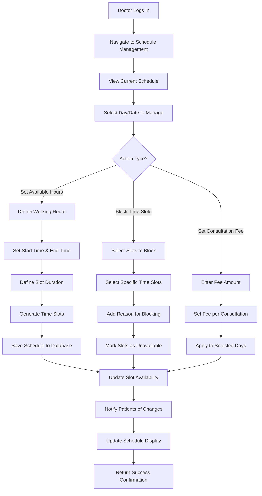
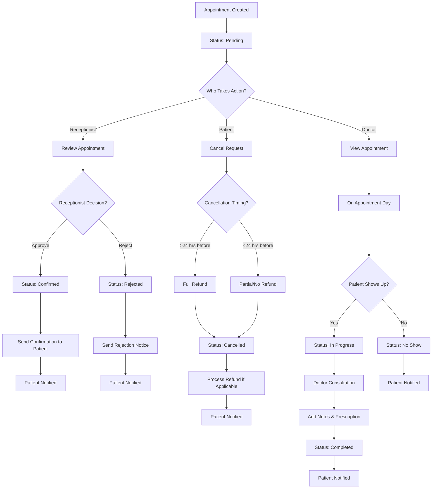
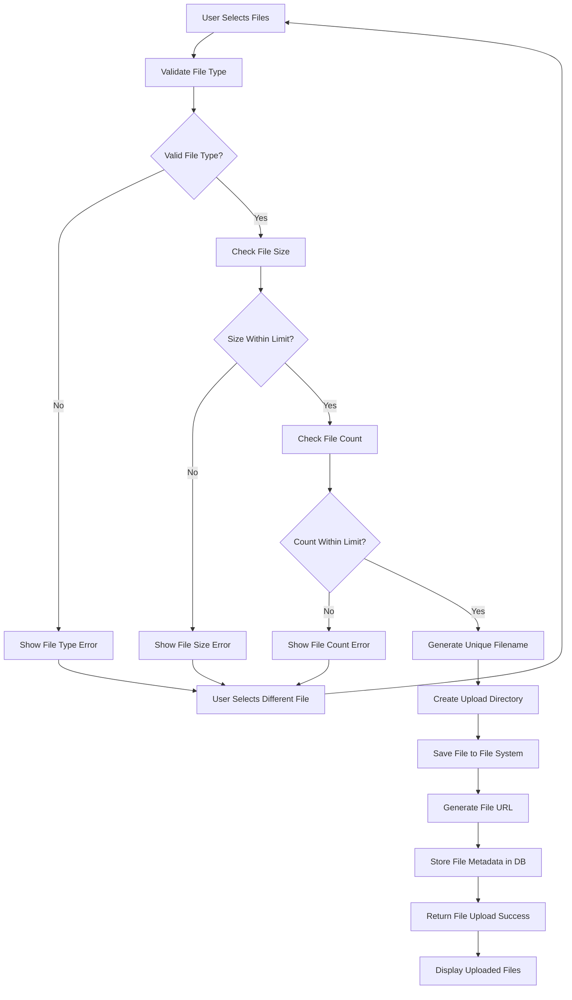
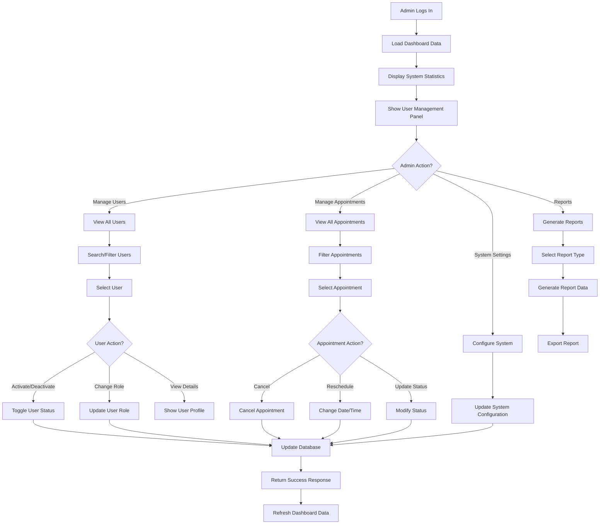
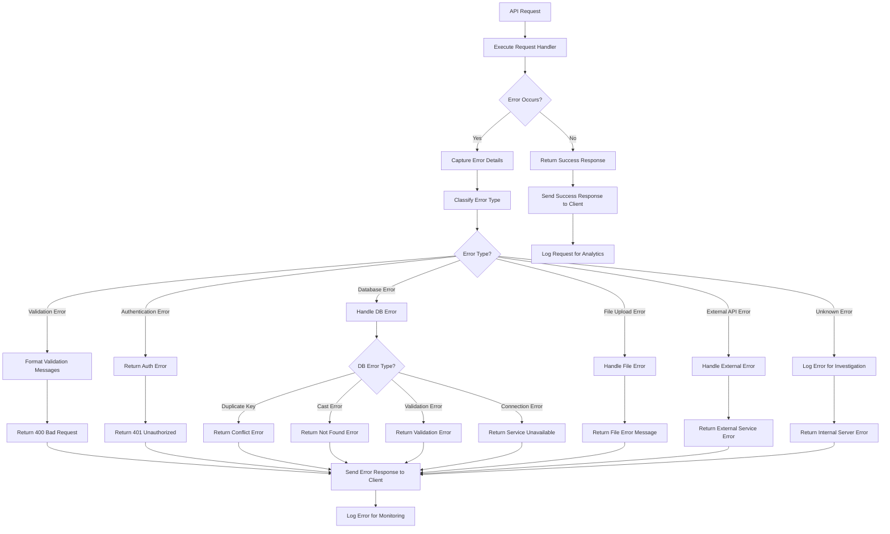
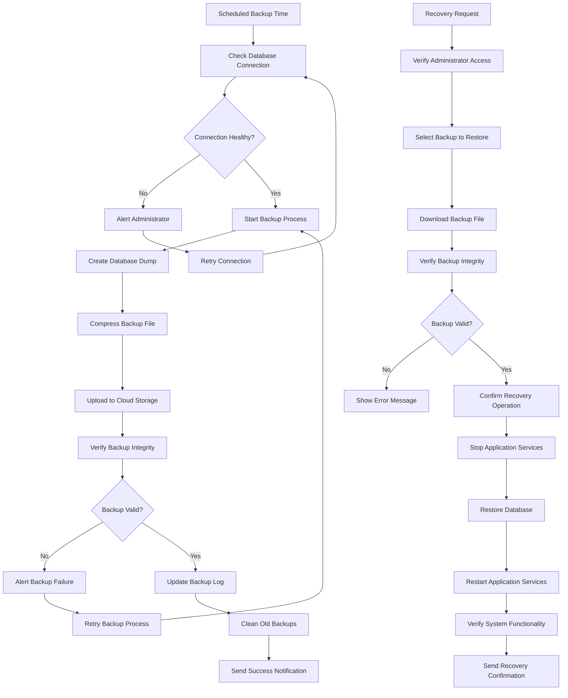
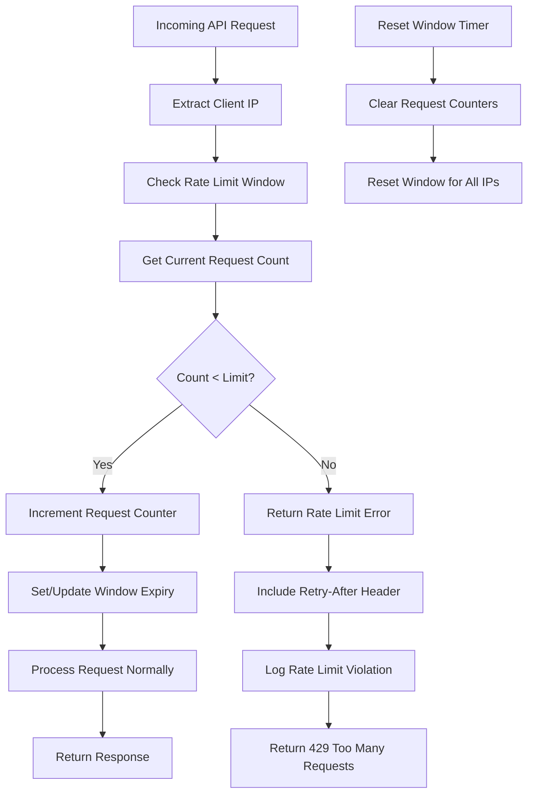

# Arthomed Backend - System Flow Charts

## Authentication Flow Chart

## User Registration & Profile Setup Flow

## Appointment Booking Flow

## Doctor Schedule Management Flow

## Appointment Status Management Flow

## File Upload & Management Flow

## Admin Dashboard Management Flow

## Error Handling & Recovery Flow

## Database Backup & Recovery Flow

## API Rate Limiting Flow

