# Arthomed Healthcare Backend - Technical Documentation

## Table of Contents
1. [System Architecture](#system-architecture)
2. [Database Design](#database-design)
3. [API Architecture](#api-architecture)
4. [Authentication System](#authentication-system)
5. [Appointment Management](#appointment-management)
6. [File Upload System](#file-upload-system)
7. [Security Implementation](#security-implementation)
8. [Performance Optimization](#performance-optimization)
9. [Error Handling](#error-handling)
10. [Deployment Architecture](#deployment-architecture)

---

## System Architecture

### High-Level Architecture Diagram

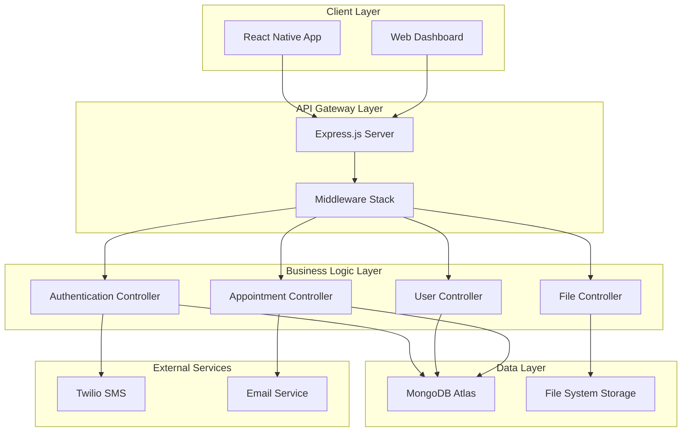

### Component Interaction Flow

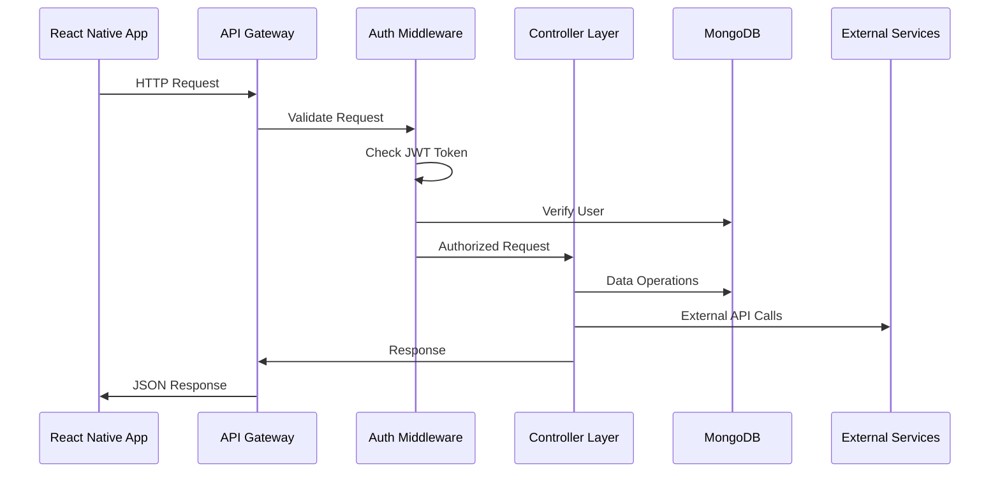

---

## Database Design

### Entity Relationship Diagram

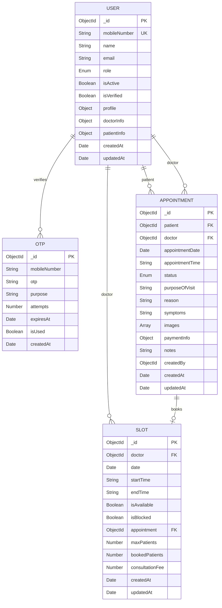

### Database Schema Details

#### User Collection Schema
```javascript
const userSchema = new mongoose.Schema({
  // Basic Information
  mobileNumber: {
    type: String,
    required: true,
    unique: true,
    match: /^[6-9]\d{9}$/,
    index: true
  },
  name: {
    type: String,
    required: true,
    trim: true,
    maxlength: 100
  },
  email: {
    type: String,
    lowercase: true,
    trim: true,
    match: /^\w+([.-]?\w+)*@\w+([.-]?\w+)*(\.\w{2,3})+$/
  },
  
  // Role & Status
  role: {
    type: String,
    enum: ['admin', 'doctor', 'receptionist', 'patient'],
    default: 'patient',
    index: true
  },
  isActive: { type: Boolean, default: true },
  isVerified: { type: Boolean, default: false },
  
  // Personal Information
  profile: {
    dateOfBirth: Date,
    gender: { type: String, enum: ['male', 'female', 'other'] },
    address: {
      street: String,
      city: String,
      state: String,
      pincode: String,
      country: { type: String, default: 'India' }
    },
    emergencyContact: {
      name: String,
      relationship: String,
      mobileNumber: String
    }
  },
  
  // Doctor-specific Information
  doctorInfo: {
    specialization: String,
    qualification: String,
    experience: Number,
    consultationFee: Number,
    registrationNumber: String,
    schedule: [{
      day: {
        type: String,
        enum: ['monday', 'tuesday', 'wednesday', 'thursday', 'friday', 'saturday', 'sunday']
      },
      startTime: String,
      endTime: String,
      isAvailable: { type: Boolean, default: true }
    }]
  },
  
  // Patient-specific Information
  patientInfo: {
    bloodGroup: String,
    allergies: [String],
    medicalHistory: [{
      condition: String,
      diagnosedDate: Date,
      treatment: String,
      doctor: String
    }],
    emergencyContact: {
      name: String,
      relationship: String,
      mobileNumber: String
    }
  }
}, {
  timestamps: true,
  toJSON: { virtuals: true },
  toObject: { virtuals: true }
});

// Indexes for performance
userSchema.index({ email: 1 });
userSchema.index({ role: 1 });
userSchema.index({ 'doctorInfo.specialization': 1 });
userSchema.index({ isActive: 1, isVerified: 1 });
```

---

## API Architecture

### RESTful API Design Pattern

```mermaid
graph TB
    subgraph "HTTP Methods"
        A[GET - Retrieve Data]
        B[POST - Create Data]
        C[PUT - Update Data]
        D[DELETE - Remove Data]
    end
    
    subgraph "Route Structure"
        E[/api/auth/* - Authentication]
        F[/api/users/* - User Management]
        G[/api/appointments/* - Appointments]
        H[/api/files/* - File Operations]
    end
    
    subgraph "Response Format"
        I[Success Response]
        J[Error Response]
        K[Paginated Response]
    end
    
    A --> E
    B --> F
    C --> G
    D --> H
    E --> I
    F --> J
    G --> K
```

### API Response Standards

#### Success Response Format
```javascript
{
  "success": true,
  "message": "Operation completed successfully",
  "data": {
    // Response data object
  },
  "timestamp": "2024-01-15T10:30:00.000Z"
}
```

#### Error Response Format
```javascript
{
  "success": false,
  "message": "Error description",
  "error": {
    "code": "ERROR_CODE",
    "statusCode": 400,
    "details": "Detailed error information"
  },
  "errors": [
    // Validation errors array
  ],
  "timestamp": "2024-01-15T10:30:00.000Z"
}
```

#### Paginated Response Format
```javascript
{
  "success": true,
  "data": {
    "items": [
      // Array of items
    ],
    "pagination": {
      "current": 1,
      "pages": 5,
      "total": 50,
      "limit": 10,
      "hasNext": true,
      "hasPrev": false
    }
  }
}
```

---

## Authentication System

### OTP-based Authentication Flow

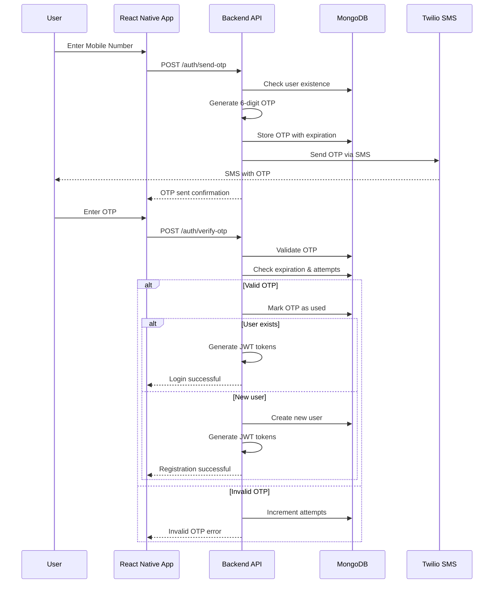

### JWT Token Management

```mermaid
graph TB
    subgraph "Token Generation"
        A[User Login/Register]
        B[Generate Access Token]
        C[Generate Refresh Token]
        D[Store Refresh Token]
    end
    
    subgraph "Token Validation"
        E[API Request]
        F[Extract Token]
        G[Verify Signature]
        H[Check Expiration]
        I[Validate User]
    end
    
    subgraph "Token Refresh"
        J[Access Token Expired]
        K[Use Refresh Token]
        L[Generate New Access Token]
        M[Return New Token]
    end
    
    A --> B
    B --> C
    C --> D
    E --> F
    F --> G
    G --> H
    H --> I
    J --> K
    K --> L
    L --> M
```

### Authentication Middleware Implementation

```javascript
const authenticate = async (req, res, next) => {
  try {
    // Extract token from Authorization header
    const token = extractTokenFromHeader(req.headers.authorization);
    
    if (!token) {
      return res.status(401).json({
        success: false,
        message: 'Access denied. No token provided.'
      });
    }

    // Verify token
    const decoded = verifyToken(token);
    
    // Find user and check if still exists and is active
    const user = await User.findById(decoded.id).select('-__v');
    
    if (!user) {
      return res.status(401).json({
        success: false,
        message: 'Invalid token. User not found.'
      });
    }

    if (!user.isActive) {
      return res.status(401).json({
        success: false,
        message: 'Account has been deactivated.'
      });
    }

    // Add user to request object
    req.user = user;
    next();
  } catch (error) {
    if (error.name === 'TokenExpiredError') {
      return res.status(401).json({
        success: false,
        message: 'Token has expired.',
        error: { code: 'TOKEN_EXPIRED' }
      });
    }
    
    return res.status(401).json({
      success: false,
      message: 'Invalid token.',
      error: { code: 'INVALID_TOKEN' }
    });
  }
};
```

---

## Appointment Management

### Appointment Lifecycle Management

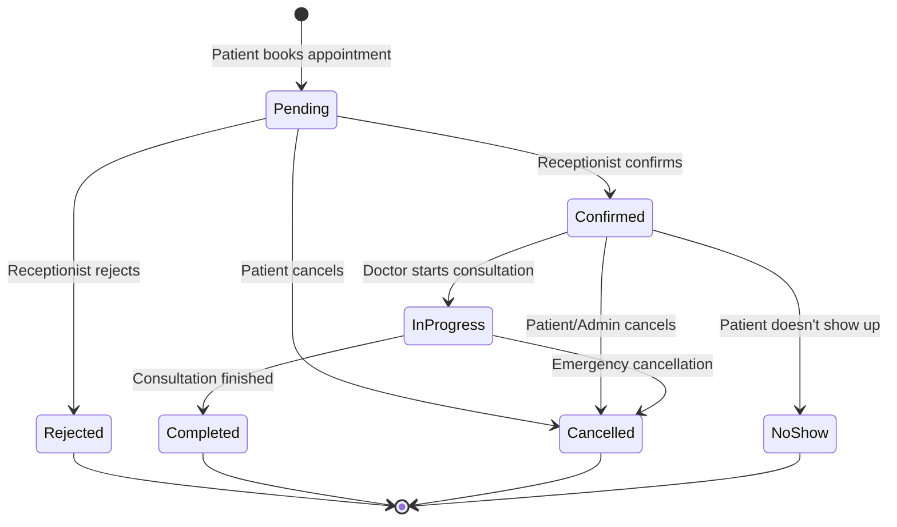

### Slot Management System

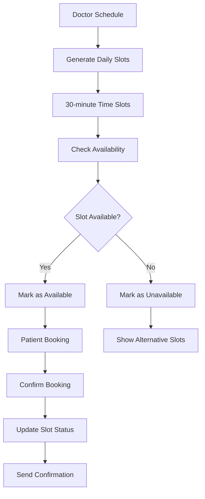

### Appointment Booking Flow

```javascript
const bookAppointment = async (req, res, next) => {
  try {
    const { doctorId, appointmentDate, appointmentTime, purposeOfVisit, reason } = req.body;
    const patientId = req.user._id;

    // Check if slot is available
    const slot = await Slot.findOne({
      doctor: doctorId,
      date: appointmentDate,
      startTime: appointmentTime,
      isAvailable: true
    });

    if (!slot) {
      return next(new AppError('Selected time slot is not available', 400));
    }

    // Check for existing appointments (prevent double booking)
    const existingAppointment = await Appointment.findOne({
      doctor: doctorId,
      appointmentDate: appointmentDate,
      appointmentTime: appointmentTime,
      status: { $nin: ['cancelled', 'rejected', 'no-show'] }
    });

    if (existingAppointment) {
      return next(new AppError('Time slot already booked', 400));
    }

    // Create appointment
    const appointment = new Appointment({
      patient: patientId,
      doctor: doctorId,
      appointmentDate,
      appointmentTime,
      purposeOfVisit,
      reason,
      status: 'pending',
      createdBy: patientId
    });

    // Handle file uploads if present
    if (req.files && req.files.length > 0) {
      appointment.images = req.files.map(file => ({
        filename: file.filename,
        originalName: file.originalname,
        path: file.path,
        size: file.size,
        mimeType: file.mimetype
      }));
    }

    await appointment.save();

    // Update slot availability
    slot.isAvailable = false;
    slot.appointment = appointment._id;
    slot.bookedPatients += 1;
    await slot.save();

    // Populate appointment details for response
    await appointment.populate([
      { path: 'patient', select: 'name mobileNumber' },
      { path: 'doctor', select: 'name doctorInfo.specialization' }
    ]);

    res.status(201).json({
      success: true,
      message: 'Appointment booked successfully',
      data: { appointment }
    });
  } catch (error) {
    next(error);
  }
};
```

---

## File Upload System

### File Upload Architecture

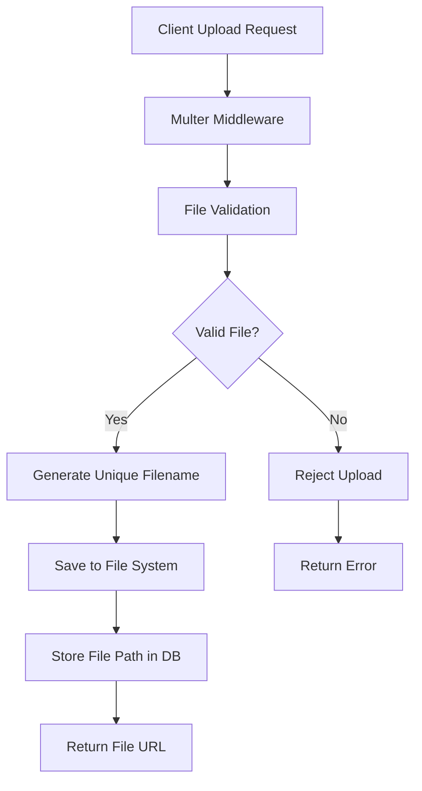

### File Storage Structure

```
uploads/
├── appointments/
│   ├── prescriptions/
│   │   ├── 2024/
│   │   │   ├── 01/
│   │   │   │   └── appointment_672b1234_1642234567890_prescription.jpg
│   │   │   └── 02/
│   │   └── 2025/
│   └── reports/
│       ├── 2024/
│       │   ├── 01/
│       │   │   └── appointment_672b5678_1642234567890_report.pdf
│       │   └── 02/
│       └── 2025/
└── profiles/
    ├── 2024/
    │   ├── 01/
    │   │   └── user_672b9012_1642234567890_avatar.jpg
    │   └── 02/
    └── 2025/
```

### File Upload Implementation

```javascript
const multer = require('multer');
const path = require('path');
const fs = require('fs').promises;

// Storage configuration
const storage = multer.diskStorage({
  destination: async (req, file, cb) => {
    const uploadType = req.params.type || 'appointments';
    const year = new Date().getFullYear();
    const month = String(new Date().getMonth() + 1).padStart(2, '0');
    
    const uploadPath = path.join('uploads', uploadType, year.toString(), month);
    
    // Create directory if it doesn't exist
    try {
      await fs.mkdir(uploadPath, { recursive: true });
      cb(null, uploadPath);
    } catch (error) {
      cb(error);
    }
  },
  filename: (req, file, cb) => {
    const uniqueSuffix = Date.now() + '-' + Math.round(Math.random() * 1E9);
    const sanitizedName = file.originalname.replace(/[^a-zA-Z0-9.]/g, '_');
    const filename = `${req.user._id}_${uniqueSuffix}_${sanitizedName}`;
    cb(null, filename);
  }
});

// File filter
const fileFilter = (req, file, cb) => {
  const allowedTypes = ['image/jpeg', 'image/jpg', 'image/png', 'application/pdf'];
  const maxSize = 10 * 1024 * 1024; // 10MB
  
  if (allowedTypes.includes(file.mimetype)) {
    cb(null, true);
  } else {
    cb(new Error('Invalid file type. Only JPG, PNG, and PDF files are allowed.'), false);
  }
};

const upload = multer({
  storage: storage,
  fileFilter: fileFilter,
  limits: {
    fileSize: 10 * 1024 * 1024, // 10MB
    files: 5 // Maximum 5 files
  }
});
```

---

## Security Implementation

### Security Architecture

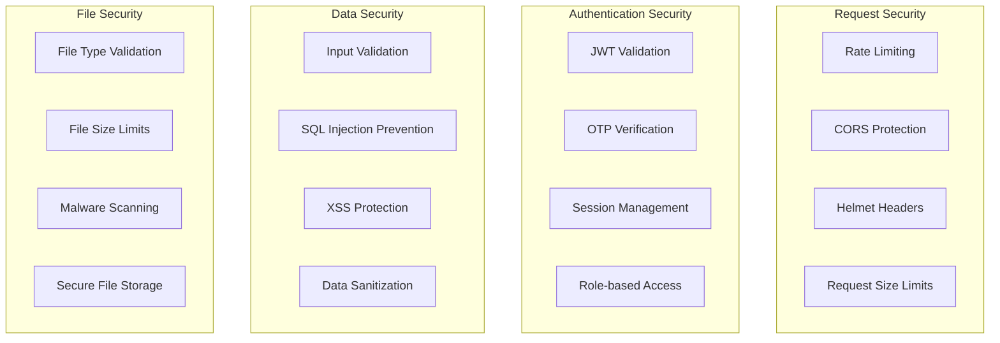

### Security Middleware Stack

```javascript
// Security middleware configuration
const securityMiddleware = (app) => {
  // Basic security headers
  app.use(helmet({
    contentSecurityPolicy: {
      directives: {
        defaultSrc: ["'self'"],
        styleSrc: ["'self'", "'unsafe-inline'"],
        scriptSrc: ["'self'"],
        imgSrc: ["'self'", "data:", "https:"],
      },
    },
    hsts: {
      maxAge: 31536000,
      includeSubDomains: true,
      preload: true
    }
  }));

  // Rate limiting
  const limiter = rateLimit({
    windowMs: parseInt(process.env.RATE_LIMIT_WINDOW_MS) || 15 * 60 * 1000, // 15 minutes
    max: parseInt(process.env.RATE_LIMIT_MAX_REQUESTS) || 100, // limit each IP to 100 requests per windowMs
    message: {
      error: 'Too many requests from this IP, please try again later.',
    },
    standardHeaders: true,
    legacyHeaders: false,
  });
  app.use(limiter);

  // CORS configuration
  app.use(cors({
    origin: process.env.NODE_ENV === 'production' 
      ? ['https://your-frontend-domain.com'] 
      : ['http://localhost:3000', 'http://localhost:19006'], // React Native Metro bundler
    credentials: true,
    methods: ['GET', 'POST', 'PUT', 'DELETE', 'OPTIONS'],
    allowedHeaders: ['Content-Type', 'Authorization'],
  }));

  // Body parsing middleware with limits
  app.use(express.json({ limit: '10mb' }));
  app.use(express.urlencoded({ extended: true, limit: '10mb' }));
};
```

### Input Validation System

```javascript
const { body, param, query, validationResult } = require('express-validator');

// Mobile number validation
const validateMobileNumber = () => [
  body('mobileNumber')
    .isLength({ min: 10, max: 10 })
    .withMessage('Mobile number must be exactly 10 digits')
    .matches(/^[6-9]\d{9}$/)
    .withMessage('Please enter a valid Indian mobile number')
    .customSanitizer(value => value.replace(/\D/g, '')) // Remove non-digits
];

// OTP validation
const validateOTP = () => [
  body('otp')
    .isLength({ min: 6, max: 6 })
    .withMessage('OTP must be exactly 6 digits')
    .matches(/^\d{6}$/)
    .withMessage('OTP must contain only numbers')
];

// User registration validation
const validateUserRegistration = () => [
  body('name')
    .trim()
    .isLength({ min: 2, max: 100 })
    .withMessage('Name must be between 2 and 100 characters')
    .matches(/^[a-zA-Z\s]+$/)
    .withMessage('Name can only contain letters and spaces'),
  
  body('email')
    .optional()
    .isEmail()
    .withMessage('Please enter a valid email address')
    .normalizeEmail(),
  
  ...validateMobileNumber(),
  ...validateOTP()
];

// Validation error handler
const handleValidationErrors = (req, res, next) => {
  const errors = validationResult(req);
  
  if (!errors.isEmpty()) {
    const errorMessages = errors.array().map(error => ({
      field: error.path,
      message: error.msg,
      value: error.value,
    }));
    
    return res.status(400).json({
      success: false,
      message: 'Validation failed',
      errors: errorMessages,
    });
  }
  
  next();
};
```

---

## Performance Optimization

### Database Performance

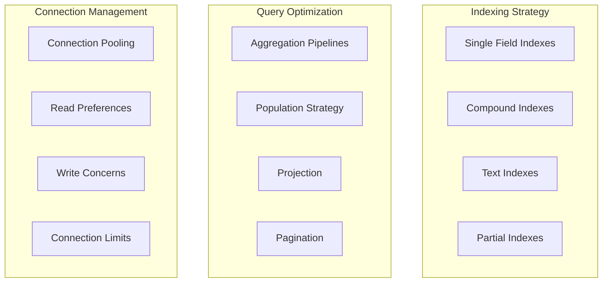

### Database Indexes Implementation

```javascript
// User collection indexes
userSchema.index({ mobileNumber: 1 }, { unique: true }); // Unique index
userSchema.index({ email: 1 });
userSchema.index({ role: 1 });
userSchema.index({ 'doctorInfo.specialization': 1 });
userSchema.index({ isActive: 1, isVerified: 1 }); // Compound index

// Appointment collection indexes
appointmentSchema.index({ patient: 1, appointmentDate: 1 });
appointmentSchema.index({ status: 1, appointmentDate: 1 });
appointmentSchema.index({ appointmentDate: 1, appointmentTime: 1 });
appointmentSchema.index({ createdAt: 1 });

// Compound unique index to prevent double booking
appointmentSchema.index(
  { doctor: 1, appointmentDate: 1, appointmentTime: 1 },
  { 
    unique: true,
    partialFilterExpression: { 
      status: { $nin: ['cancelled', 'no-show'] } 
    }
  }
);

// Slot collection indexes
slotSchema.index({ date: 1, isAvailable: 1 });
slotSchema.index({ doctor: 1, isAvailable: 1 });
slotSchema.index(
  { doctor: 1, date: 1, startTime: 1 },
  { unique: true }
);

// OTP collection indexes with TTL
otpSchema.index({ expiresAt: 1 }, { expireAfterSeconds: 0 }); // TTL index
otpSchema.index({ mobileNumber: 1, createdAt: 1 });
```

### Pagination Implementation

```javascript
const getPaginatedResults = async (model, query, options) => {
  const {
    page = 1,
    limit = 10,
    sort = { createdAt: -1 },
    populate = null,
    select = null
  } = options;

  const skip = (parseInt(page) - 1) * parseInt(limit);
  
  // Build query
  let queryBuilder = model.find(query);
  
  if (select) queryBuilder = queryBuilder.select(select);
  if (populate) queryBuilder = queryBuilder.populate(populate);
  
  // Execute queries in parallel
  const [items, total] = await Promise.all([
    queryBuilder
      .sort(sort)
      .skip(skip)
      .limit(parseInt(limit))
      .lean(),
    model.countDocuments(query)
  ]);
  
  const pages = Math.ceil(total / limit);
  
  return {
    items,
    pagination: {
      current: parseInt(page),
      pages,
      total,
      limit: parseInt(limit),
      hasNext: page < pages,
      hasPrev: page > 1
    }
  };
};
```

---

## Error Handling

### Error Handling Architecture

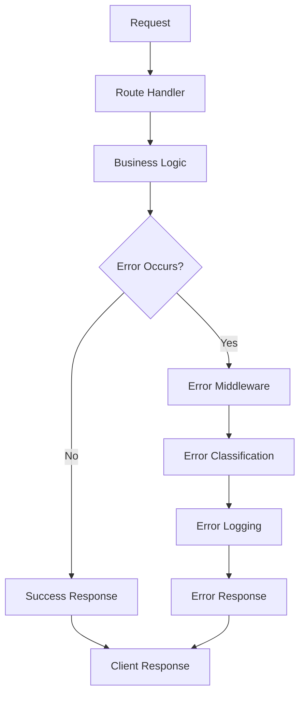

### Global Error Handler Implementation

```javascript
class AppError extends Error {
  constructor(message, statusCode) {
    super(message);
    this.statusCode = statusCode;
    this.status = `${statusCode}`.startsWith('4') ? 'fail' : 'error';
    this.isOperational = true;

    Error.captureStackTrace(this, this.constructor);
  }
}

const errorHandler = (err, req, res, next) => {
  let error = { ...err };
  error.message = err.message;

  // Log error
  console.error('Error:', err);

  // Mongoose bad ObjectId
  if (err.name === 'CastError') {
    const message = 'Resource not found';
    error = new AppError(message, 404);
  }

  // Mongoose duplicate key
  if (err.code === 11000) {
    let message = 'Duplicate field value entered';
    
    // Extract field name from error
    const field = Object.keys(err.keyValue)[0];
    if (field === 'mobileNumber') {
      message = 'Mobile number is already registered';
    } else if (field === 'email') {
      message = 'Email address is already registered';
    }
    
    error = new AppError(message, 400);
  }

  // Mongoose validation error
  if (err.name === 'ValidationError') {
    const message = Object.values(err.errors).map(val => val.message).join(', ');
    error = new AppError(message, 400);
  }

  // JWT errors
  if (err.name === 'JsonWebTokenError') {
    const message = 'Invalid token. Please log in again.';
    error = new AppError(message, 401);
  }

  if (err.name === 'TokenExpiredError') {
    const message = 'Your token has expired. Please log in again.';
    error = new AppError(message, 401);
  }

  // Multer errors
  if (err.code === 'LIMIT_FILE_SIZE') {
    const message = 'File too large. Maximum size allowed is 10MB.';
    error = new AppError(message, 400);
  }

  if (err.code === 'LIMIT_FILE_COUNT') {
    const message = 'Too many files. Maximum 5 files allowed.';
    error = new AppError(message, 400);
  }

  res.status(error.statusCode || 500).json({
    success: false,
    message: error.message || 'Internal server error',
    ...(process.env.NODE_ENV === 'development' && { 
      error: error,
      stack: err.stack 
    })
  });
};

// Async handler wrapper
const asyncHandler = (fn) => (req, res, next) => {
  Promise.resolve(fn(req, res, next)).catch(next);
};
```

---

## Deployment Architecture

### Production Deployment Flow

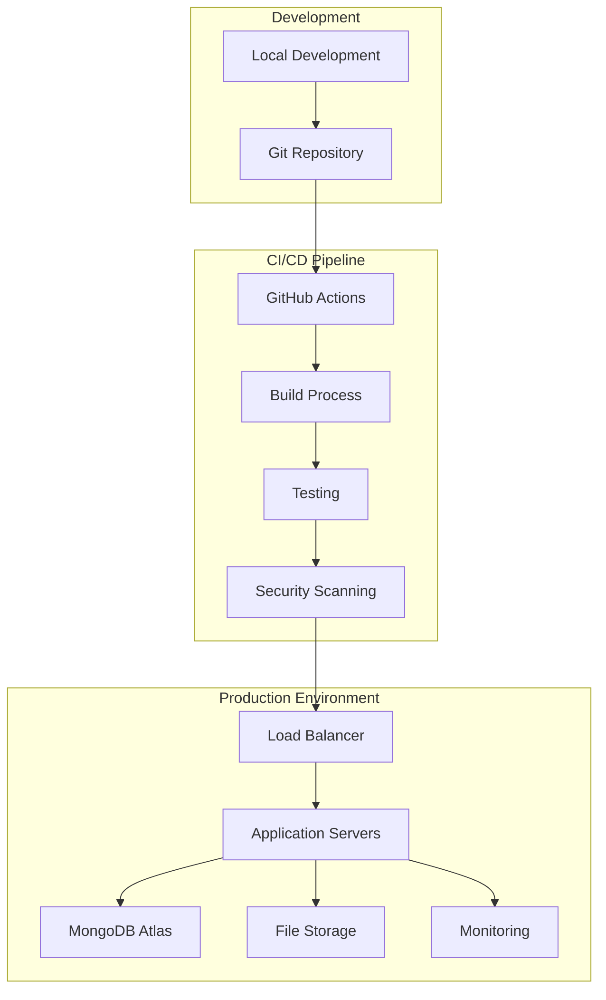

### Environment Configuration

```javascript
// Production environment variables
const productionConfig = {
  // Server
  NODE_ENV: 'production',
  PORT: process.env.PORT || 5000,
  
  // Database
  MONGODB_URI: process.env.MONGODB_URI,
  
  // Security
  JWT_SECRET: process.env.JWT_SECRET,
  JWT_REFRESH_SECRET: process.env.JWT_REFRESH_SECRET,
  
  // External Services
  TWILIO_ACCOUNT_SID: process.env.TWILIO_ACCOUNT_SID,
  TWILIO_AUTH_TOKEN: process.env.TWILIO_AUTH_TOKEN,
  
  // Performance
  RATE_LIMIT_WINDOW_MS: 900000, // 15 minutes
  RATE_LIMIT_MAX_REQUESTS: 100,
  
  // Monitoring
  LOG_LEVEL: 'info',
  ENABLE_METRICS: true
};

// Health check endpoint
app.get('/health', (req, res) => {
  const healthcheck = {
    uptime: process.uptime(),
    message: 'OK',
    timestamp: Date.now(),
    environment: process.env.NODE_ENV,
    version: process.env.npm_package_version
  };
  
  try {
    res.send(healthcheck);
  } catch (error) {
    healthcheck.message = error;
    res.status(503).send();
  }
});
```

### Monitoring and Logging

```javascript
// Request logging middleware
const requestLogger = (req, res, next) => {
  const startTime = Date.now();
  
  res.on('finish', () => {
    const duration = Date.now() - startTime;
    const logData = {
      method: req.method,
      url: req.url,
      statusCode: res.statusCode,
      duration: `${duration}ms`,
      ip: req.ip,
      userAgent: req.get('User-Agent'),
      userId: req.user ? req.user._id : 'anonymous',
      timestamp: new Date().toISOString()
    };
    
    if (res.statusCode >= 400) {
      console.error('Request Error:', logData);
    } else {
      console.log('Request:', logData);
    }
  });
  
  next();
};

// Performance monitoring
const performanceMonitor = {
  trackApiResponse: (endpoint, duration, statusCode) => {
    // Send metrics to monitoring service
    console.log(`API Performance: ${endpoint} - ${duration}ms - ${statusCode}`);
  },
  
  trackError: (error, context) => {
    // Send error to error tracking service
    console.error('Application Error:', {
      message: error.message,
      stack: error.stack,
      context,
      timestamp: new Date().toISOString()
    });
  }
};
```

---

## Integration Guidelines

### React Native Integration

```javascript
// API service configuration for React Native
class ApiService {
  constructor() {
    this.baseURL = 'http://localhost:3001/api';
    this.token = null;
  }

  setToken(token) {
    this.token = token;
  }

  async request(endpoint, options = {}) {
    const url = `${this.baseURL}${endpoint}`;
    const config = {
      headers: {
        'Content-Type': 'application/json',
        ...(this.token && { Authorization: `Bearer ${this.token}` }),
        ...options.headers,
      },
      ...options,
    };

    try {
      const response = await fetch(url, config);
      const data = await response.json();

      if (!response.ok) {
        throw new Error(data.message || 'Request failed');
      }

      return data;
    } catch (error) {
      console.error('API Request Error:', error);
      throw error;
    }
  }

  // Authentication methods
  async sendOTP(mobileNumber) {
    return this.request('/auth/send-otp', {
      method: 'POST',
      body: JSON.stringify({ mobileNumber }),
    });
  }

  async verifyOTP(mobileNumber, otp) {
    return this.request('/auth/verify-otp', {
      method: 'POST',
      body: JSON.stringify({ mobileNumber, otp }),
    });
  }

  // Appointment methods
  async bookAppointment(appointmentData) {
    return this.request('/appointments/book', {
      method: 'POST',
      body: JSON.stringify(appointmentData),
    });
  }

  async getAvailableSlots(doctorId, date) {
    return this.request(`/appointments/slots?doctorId=${doctorId}&date=${date}`);
  }
}
```

This comprehensive technical documentation covers all aspects of the Arthomed healthcare backend system, from high-level architecture to implementation details. It serves as a complete reference for developers, system administrators, and stakeholders involved in the project.
